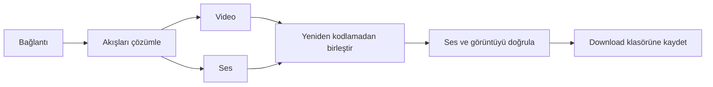

<p align="center">
  
</p>

<p align="center">
  <a href="https://github.com/eekilinc/indirgitsin/releases/latest"></a>
  <a href="https://github.com/eekilinc/indirgitsin/actions/workflows/release.yml"></a>
  
  
</p>

<p align="center">
  <strong>Videonu veya sesini seç. İndirmelerini tek yerden yönet.</strong><br>
  Android için Kotlin ve Jetpack Compose ile geliştirilmiş video/ses indirme yöneticisi.
</p>

<p align="center">
  <a href="https://github.com/eekilinc/indirgitsin/releases/latest"><strong>↓ Final APK'yı indir</strong></a>
  · <a href="docs/RELEASING.md">Derleme</a>
  · <a href="docs/VALIDATION.md">Test rehberi</a>
  · <a href="docs/PRIVACY.md">Gizlilik</a>
  · <a href="https://github.com/eekilinc/indirgitsin/issues">Geri bildirim</a>
</p>

> **Yalnızca indirme hakkınız ve ilgili hizmetin izni bulunan içerikleri kullanın.**
> Proje YouTube/Google ile bağlantılı değildir. Public kaynak kodu veya GitHub yayını, Play Store kabulü anlamına gelmez.

## Bir bağlantıdan tek dosyaya

YouTube video, Shorts, Music ve oynatma listesi bağlantılarını ekleyin; mevcut sesli video veya ses seçeneklerinden birini seçin. Ayrı video ve ses akışları gerektiğinde paralel indirilir ve **yeniden kodlanmadan** birleştirilir. Sonuçta ses/görüntü izleri doğrulanmadan işlem başarılı sayılmaz.

| Özellik | Nasıl çalışır? |
|---|---|
| Sesli video | MP4 veya cihazın desteklediği WebM eşleştirmesi; sessiz çıktıyı başarılı saymaz. |
| Ses dosyası | Gerçek M4A/WebM akışı; sahte MP3 uzantısı yok. |
| Kalıcı kuyruk | WorkManager ile iki eşzamanlı iş, iptal ve başarısız işten yeniden deneme. |
| İlerleme | Toplam video/ses hızı ve tahmini kalan aktarım süresi. |
| Ağ tercihi | İsteğe bağlı yalnızca tarifesiz ağda indirme. |
| Dosya yönetimi | Arama, tür filtresi, tarih/ad/boyut sıralaması ve silme onayı. |
| Kitaplık | Yerel geçmiş ve uygulama içi oynatma. |
| Görünüm | Türkçe/İngilizce, açık/koyu tema ve vurgu rengi seçimi. |

## 1.2 hazırlığında

Çalışan son final **1.1.1**'dir. Bu geliştirme dalındaki değişiklikler final diye sunulmaz:

- Bağlantı girişini öne çıkaran yeni ana sayfa ve özgün indirme simgesi.
- Kesintiden sonra doğrulanmış 4 MB HTTP parçalarından devam. Dosya kimliği doğrulanamıyorsa güvenli yeniden başlangıç.
- Etkin olmayan yarım dosyaları temizleme; 7 günden eski parçalar için açılışta bakım.
- Public GitHub güncelleme kontrolü; otomatik kontrolde altı saatlik aralık ve HTTP önbelleği.
- TR/EN çevrimdışı gizlilik politikası.
- Android 16 hedefi, optimize final APK/AAB ve daha geniş cihaz doğrulaması.

## Kurulum

1. **[Son final sürümünü](https://github.com/eekilinc/indirgitsin/releases/latest)** açın; APK dosyasını indirin. **GitHub hesabı gerekmez.**
2. Android'in dosyayı açan tarayıcı/dosya yöneticisi için istediği yükleme iznini verin.
3. İsterseniz dosyanın SHA-256 değerini aynı yayındaki `SHA256SUMS.txt` ile karşılaştırın.

Final paket kimliği `com.indirgitsin.app.stable` olarak sabittir. 1.1.1 ve sonraki final güncellemeleri aynı imzayı korur. **İndir Gitsin Test** ayrı uygulamadır; test uygulamasını kaldırmak zorunlu değildir.

## Neden hızlı?

Video ve ses paralel aktarılır. Birleştirme sırasında görüntü yeniden kodlanmaz; kaynak örnekleri zaman damgaları korunarak kopyalanır. Akış tamponları sınırlıdır, dosya bütünü RAM'e yüklenmez. Gerçek hız ağınıza, kaynağa ve cihaza bağlıdır; sabit hız ya da pil ömrü taahhüdü yoktur.



## Sınırları açıkça

**MP3 dönüştürme ve HLS/canlı yayın kaydı yoktur.** Kalite, kaynak akışlarına ve cihaz codec desteğine bağlıdır. WebM/Opus birleştirme Android 10+, MP4/AV1 Android 14+ ister. YouTube değişiklikleri veya erişim kısıtları bazı videoları etkileyebilir.

Devam etme, doğrulanmış tam HTTP parçalarını kullanır; kesilen son parça yeniden alınabilir. Tamamlanan dosyalar ortak Download alanındadır. Android'in zorla durdurma, ağ ve arka plan sınırları işlemleri erteleyebilir.

## Geliştirme ve kalite

```sh
git clone --recurse-submodules https://github.com/eekilinc/indirgitsin.git
cd indirgitsin
./gradlew :app:assembleDebug
```

JDK 17, Android SDK 36 ve Android 7.0+ gerekir. UI: Compose/Material 3; veri: Room/DataStore; aktarım: OkHttp/WorkManager; medya: Android MediaMuxer/Media3; çözümleme: NewPipeExtractor ve sabitlenmiş cipher alt modülü.

**[Derleme ve imzalama](docs/RELEASING.md)** · **[Doğrulama rehberi](docs/VALIDATION.md)** · **[Yayın hazırlığı ve performans sınırları](docs/PUBLISHING_READINESS.md)**

## Public depo ve lisans

Hata raporları için [issue şablonunu](https://github.com/eekilinc/indirgitsin/issues/new/choose), güvenlik açıkları için [özel bildirim kanalını](SECURITY.md) kullanın. PR'lar test edilir; imza sırları PR işlerine verilmez.

**Ana proje lisansı henüz seçilmemiştir.** Public erişim kendiliğinden yeniden dağıtım lisansı vermez. GPL bileşenleri ve kaynak kodu yükümlülükleri için [lisans durumunu](docs/LICENSE_STATUS.md) okuyun. Ana bağımlılık metinleri uygulamada Ayarlar → Lisans bölümündedir.

[Katkıda bulunma](CONTRIBUTING.md) · [Gizlilik politikası](docs/PRIVACY.md) · [Güvenlik](SECURITY.md)
