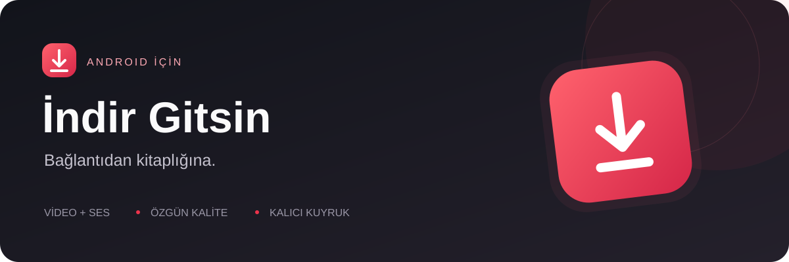
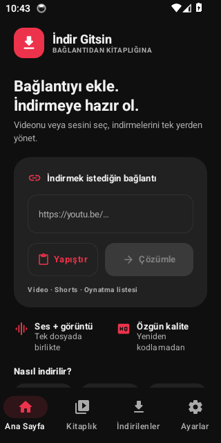
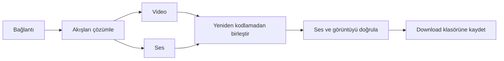

<p align="center">
  
</p>

<p align="center">
  <a href="https://github.com/eekilinc/indirgitsin/releases/latest"></a>
  <a href="https://github.com/eekilinc/indirgitsin/actions/workflows/release.yml"></a>
  
  
</p>

<p align="center">
  <strong>Videonu veya sesini seç. İndirmelerini tek yerden yönet.</strong><br>
  Android için Kotlin ve Jetpack Compose ile geliştirilmiş video/ses indirme yöneticisi.
</p>

<p align="center">
  <a href="https://github.com/eekilinc/indirgitsin/releases/latest"><strong>↓ Final APK'yı indir</strong></a>
  · <a href="docs/RELEASING.md">Derleme</a>
  · <a href="docs/VALIDATION.md">Test rehberi</a>
  · <a href="docs/PRIVACY.md">Gizlilik</a>
  · <a href="https://github.com/eekilinc/indirgitsin/issues">Geri bildirim</a>
</p>

> **Yalnızca indirme hakkınız ve ilgili hizmetin izni bulunan içerikleri kullanın.**
> Proje YouTube/Google ile bağlantılı değildir. Public kaynak kodu veya GitHub yayını, Play Store kabulü anlamına gelmez.

## Bir bağlantıdan tek dosyaya

YouTube video, Shorts, Music ve oynatma listesi bağlantılarını ekleyin; mevcut sesli video veya ses seçeneklerinden birini seçin. Ayrı video ve ses akışları gerektiğinde paralel indirilir ve **yeniden kodlanmadan** birleştirilir. Sonuçta ses/görüntü izleri doğrulanmadan işlem başarılı sayılmaz.

| Özellik | Nasıl çalışır? |
|---|---|
| Sesli video | MP4 veya cihazın desteklediği WebM eşleştirmesi; sessiz çıktıyı başarılı saymaz. |
| Ses dosyası | M4A/WebM özgün ses veya cihazda dönüştürülen 128/192/320 kbps MP3. |
| Ses kapakları | MP3 içine gömülü kapak, başlık ve sanatçı; M4A/WebM için çevrimdışı uygulama kapağı. |
| Tam ekran | Yatay video, gizlenen sistem çubukları, konumu koruyan ekran döndürme. |
| Kalıcı kuyruk | WorkManager ile iki eşzamanlı iş, iptal ve başarısız işten yeniden deneme. |
| İlerleme | Toplam video/ses hızı ve tahmini kalan aktarım süresi. |
| Ağ tercihi | İsteğe bağlı yalnızca tarifesiz ağda indirme. |
| Dosya yönetimi | Arama, tür filtresi, tarih/ad/boyut sıralaması ve silme onayı. |
| Kitaplık | Yerel geçmiş ve uygulama içi oynatma. |
| Görünüm | Türkçe/İngilizce, açık/koyu tema ve vurgu rengi seçimi. |

## 1.2 ile gelenler

MP3, canlı kayıt ve yeni oynatıcı bir arada. Kalıcı paket ve imza korunur; önceki finali kaldırmadan güncelleyebilirsiniz:

- Bağlantı girişini öne çıkaran yeni ana sayfa ve özgün indirme simgesi.
- Kesintiden sonra doğrulanmış 4 MB HTTP parçalarından devam. Dosya kimliği doğrulanamıyorsa güvenli yeniden başlangıç.
- Etkin olmayan yarım dosyaları temizleme; 7 günden eski parçalar için açılışta bakım.
- Public GitHub güncelleme kontrolü; otomatik kontrolde altı saatlik aralık ve HTTP önbelleği.
- TR/EN çevrimdışı gizlilik politikası.
- Android 16 hedefi, optimize final APK/AAB ve daha geniş cihaz doğrulaması.
- Kapaklı ses oynatıcı; görsel bulunmayan eski dosyalarda müzik görünümü.
- Videoda tam ekran, ekran döndürmede konumun korunması ve oynatma hatasında yeniden deneme.
- Gerçek MP3 dönüşümü: 128, 192 veya 320 kbps; kaynak ses cihazda MP3’e kodlanır.
- Şifresiz birleşik HLS canlı kayıt: 5/15/30/60 dakika, **Durdur ve kaydet**, kesintiden önceki bölümün kurtarılması.

<p align="center">
  
</p>
<p align="center"><sub>1.2.0-dev.118 · Android 14 emülatörü · gerçek uygulama görüntüsü</sub></p>

## Kurulum

1. **[Son final sürümünü](https://github.com/eekilinc/indirgitsin/releases/latest)** açın; APK dosyasını indirin. **GitHub hesabı gerekmez.**
2. Android'in dosyayı açan tarayıcı/dosya yöneticisi için istediği yükleme iznini verin.
3. İsterseniz dosyanın SHA-256 değerini aynı yayındaki `SHA256SUMS.txt` ile karşılaştırın.

Final paket kimliği `com.indirgitsin.app.stable` olarak sabittir. 1.1.1 ve sonraki final güncellemeleri aynı imzayı korur. **İndir Gitsin Test** ayrı uygulamadır; test uygulamasını kaldırmak zorunlu değildir.

## Final ve doğrulama

**[1.2.0 APK’yı indir](https://github.com/eekilinc/indirgitsin/releases/download/v1.2.0/indir-gitsin-1.2.0.apk)** · [Sürüm, kaynak ZIP ve SHA-256](https://github.com/eekilinc/indirgitsin/releases/tag/v1.2.0)

Final yayın kapıları: 57 uygulama birim testi, 62 cipher testi, Node/Python kontrolleri ve lint; Android 10/14/16’da 14’er cihaz testi; kalıcı imzalı APK’da Android 14 üzerinde aynı 14 test. Sertifika, 16 KiB native hizalaması ve 1.1.1’den güncelleme ayrıca denetlenir. Bir kapı başarısız olursa final yayımlanmaz. APK’ya ait tam çalışma bağlantısı sürüm sayfasındadır.

Kullanıcı önceki imzalı adayda sesli video indirme ve MP3 dönüşümünü telefonunda doğruladı. Yeni kapak/tam ekran özellikleri için [kullanım ve cihaz kontrolü](docs/PLAYBACK.md); ölçümlerin kapsamı ve kalan fiziksel cihaz kontrolleri için [doğrulama rehberi](docs/VALIDATION.md).

Önceki **1.2.0-dev.118** ölçümünde APK **16,81 MB → 4,89 MB**, aynı Android 14 emülatöründe ortanca soğuk açılış **797 → 632 ms**, boşta PSS **54.557 → 34.232 KiB** idi. Bunlar kapak/tam ekran öncesi adayın değerleridir; final dosya boyutu sürüm sayfasındadır. Gerçek telefon, indirme hızı veya pil garantisi değildir. [Ham ölçümler](docs/measurements/candidate-118.json).

## Neden hızlı?

Video ve ses paralel aktarılır. Birleştirme sırasında görüntü yeniden kodlanmaz; kaynak örnekleri zaman damgaları korunarak kopyalanır. Akış tamponları sınırlıdır, dosya bütünü RAM'e yüklenmez. Gerçek hız ağınıza, kaynağa ve cihaza bağlıdır; sabit hız ya da pil ömrü taahhüdü yoktur.



## Sınırları açıkça

1.2 sürümünde MP3 kodlama ve sınırlı HLS canlı kayıt vardır. MP3 kayıplı dönüşümdür; yüksek bitrate kaynak sesin kalitesini artırmaz. Canlı kayıt en fazla 60 dakika / 2 GiB ile sınırlıdır; en son tamamlanan parçadan başlar. Birleşik AVC/AAC akışları desteklenir; ayrı ses listeleri, DASH ve DRM desteklenmez. **İptal** geçici kaydı siler; **Durdur ve kaydet** tamamlanan bölümü saklar. [Kullanım ve sınırlar](docs/MP3_LIVE.md). Kalite, kaynak akışlarına ve cihaz codec desteğine bağlıdır. WebM/Opus birleştirme Android 10+, MP4/AV1 Android 14+ ister. YouTube değişiklikleri veya erişim kısıtları bazı videoları etkileyebilir.

Devam etme, doğrulanmış tam HTTP parçalarını kullanır; kesilen son parça yeniden alınabilir. Tamamlanan dosyalar ortak Download alanındadır. Android'in zorla durdurma, ağ ve arka plan sınırları işlemleri erteleyebilir.

MP3 kapağı dosyayla birlikte paylaşılır. M4A/WebM kapakları yalnızca uygulamanın özel alanında tutulur; kapak deposu 256 kayıtla sınırlıdır. Eski dosyalarda gömülü kapak yoksa müzik simgesi gösterilir. Arka planda müzik çalma ve küçük pencere (PiP) bu sürümde yoktur. [Oynatıcı ayrıntıları](docs/PLAYBACK.md).

## Geliştirme ve kalite

```sh
git clone --recurse-submodules https://github.com/eekilinc/indirgitsin.git
cd indirgitsin
./gradlew :app:assembleDebug
```

JDK 17, Android SDK 36, NDK 28.2.13676358, CMake 3.22.1 ve Android 7.0+ gerekir. Gradle sabit NDK/CMake sürümlerini kullanır. Cihaz testinden önce `bash tools/generate-hls-fixtures.sh` çalıştırılır (FFmpeg yalnızca sentetik test dosyalarını üretir). UI: Compose/Material 3; veri: Room/DataStore; aktarım: OkHttp/WorkManager; medya: Android MediaMuxer/Media3; çözümleme: NewPipeExtractor ve sabitlenmiş cipher alt modülü.

**[Derleme ve imzalama](docs/RELEASING.md)** · **[Doğrulama rehberi](docs/VALIDATION.md)** · **[Yayın hazırlığı ve performans sınırları](docs/PUBLISHING_READINESS.md)**

## Public depo ve lisans

Hata raporları için [issue şablonunu](https://github.com/eekilinc/indirgitsin/issues/new/choose), güvenlik açıkları için [özel bildirim kanalını](SECURITY.md) kullanın. PR'lar test edilir; imza sırları PR işlerine verilmez.

**GPL-3.0-only.** Hak sahibi onayıyla ana proje [GNU GPL v3](LICENSE) altında yayımlanır. Üçüncü taraf bileşenlerin kendi lisansları korunur; LAME 3.100 encoder kaynakları ve LGPL metni depoda ve kaynak ZIP’inde yer alır. [Lisans ve kaynak dağıtımı](docs/LICENSE_STATUS.md). Ana bağımlılık metinleri uygulamada Ayarlar → Lisans bölümündedir.

[Katkıda bulunma](CONTRIBUTING.md) · [Gizlilik politikası](docs/PRIVACY.md) · [Güvenlik](SECURITY.md)
